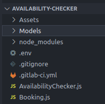

# Availability Checker

## Description

This component is part of the the distributed system DENTISTIMO, a web application that offers a geolocalisation based dental care booking system.
The avaliability checker provides the booking handler with valid booking requests and Dentistimo GUI with valid timeslots. More details can be found in the component diagram in the [documentation repository](https://github.com/emilieanthony/dentistimo-documentation). 

## System architechture


## Component Responsibilities

- Check if chosen time slot from the timeslot generator has available appointments 
- Filter timeslots so that dentists can have lunch and fika
- Forward this information to frontend that displays only available timeslots
- Validate booking requests
- Forward valid bookings to the booking handler


## Data input and output
### Data input

The component expects stringified json objects sent via MQTT. 

#### Data input from time slots generator
- Timeslots

<b>Example</b>

```
{
"clinicId": "",
"timeslots":[
  {
    "_id": "61bc57e6ce0d87512e7329ab",
    "start": "9:00",
    "end": "9:30",
    "available": 3,
    "date": "Thu Dec 02 2021"
},
  {
    "_id": "61bc57e6ce0d87512e7329ac",
    "start": "9:30",
    "end": "10:00",
    "available": 3,
    "date": "Thu Dec 02 2021"
  },
  {
    "_id": "61bc57e6ce0d87512e7329ad",
    "start": "10:00",
    "end": "10:30",
    "available": 3,
    "date": "Thu Dec 02 2021"
  },
  {
    "_id": "61bc57e6ce0d87512e7329ae",
    "start": "10:30",
    "end": "11:00",
    "available": 3,
    "date": "Thu Dec 02 2021"
  },
  {
    "_id": "61bc57e6ce0d87512e7329ba",
    "start": "16:30",
    "end": "17:00",
    "available": 3,
    "date": "Thu Dec 02 2021"
  }
]
}
```


#### Data input from frontend
- Booking information

**Example**
```
{
"_id":"61c1c78d11a27701b938fd09",
"userSSN":124,
"clinic":"61c1c29ea80761ab249e4e1f",
"date":"2021-12-15",
"startTime":"7:00-7:30"
}
```


### Data output

#### Data output to booking handler
- Forward booking requests from the frontent in the right format to the booking handler

**Example**

```
{
  _id: new ObjectId("61c1cfe391f392eb3210efa9"),
  userSSN: 7712318998,
  clinic: new ObjectId("61c1c29ea80761ab249e4e1f"),
  date: '2021-12-29',
  startTime: '8:30-9:00'
}
```


#### Data output to frontend
- Validation or rejection


## Installing and running

### Prerequisits:
#### MQTT
You need to have a running version of <b>MQTT</b> on your machine. Please refer to this [link](https://www.google.com/url?sa=t&rct=j&q=&esrc=s&source=web&cd=&ved=2ahUKEwjG3fWb6NH0AhXpQvEDHSGLC2MQFnoECAMQAQ&url=https%3A%2F%2Fmosquitto.org%2Fdownload%2F&usg=AOvVaw2rLN-Os_zfUrtqeV1Lrunf) to download the mosquitto broker if you do not have any. 
#### Node.js
To download the latest version of node.js, please follow this [link](https://nodejs.org/en/download/)

### Instructions

| Step | Command |
| ------ | ------ |
| start your MQTT broker on port 1883| This differs based on which broker, as well as your settings. Make sure the broker listens to port 1883. (Default port with mosquitto) |
| clone this project on your machine | `git clone < SSH address or HTTPS address >` |
| go to repo and add .env file | Please contact one of the developers of this project to recieve the contents of the file. It should be placed directly in the repo. |
| Install necessary dependencies  | `npm install` |
| Start the system from the repo by running the following  | `npm start` |

In the window of your broker, you should see a message similar to this:

`1638885841: New client connected from 127.0.0.1:49531 as Dentistimo Team5 - Avaliability Checker n°3c1ff99e (p2, c1, k60).`

The availability checker is now ready to proceed your requests.  


